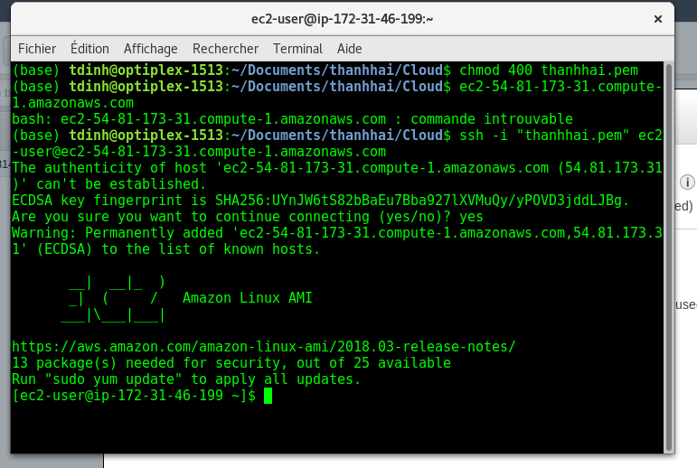
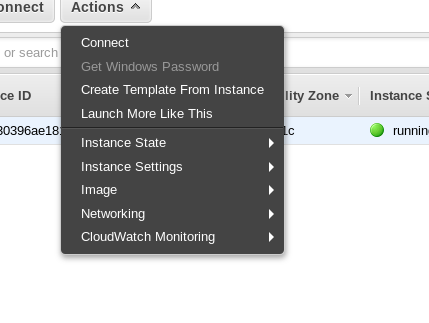
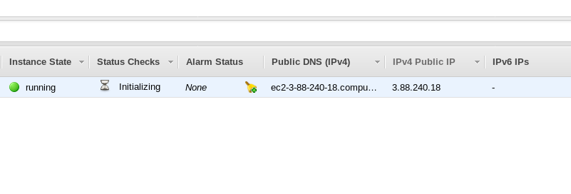
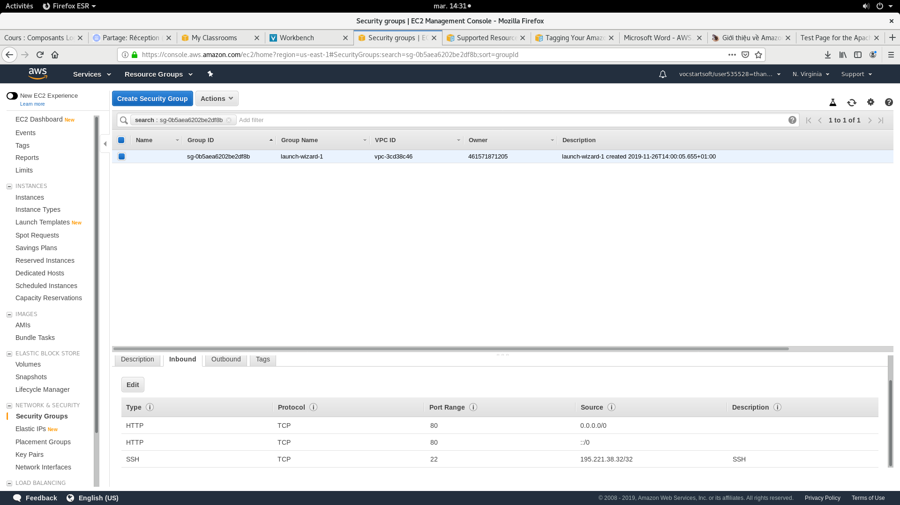
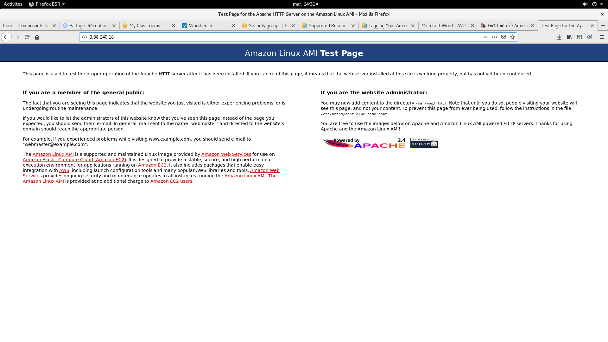
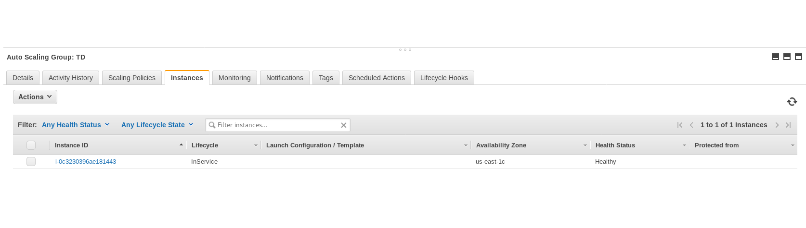
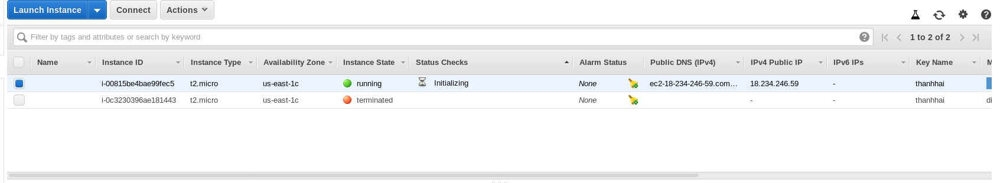
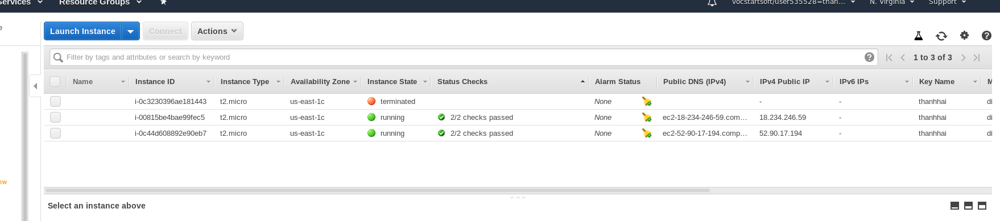
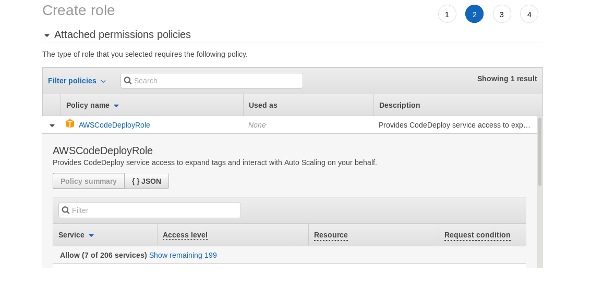

# DINH THANH HAI
# TD Cloud Computing


## Introduction

Les services disponibles sont : EC2, Deeplens, CodeDeploys, Codepipeline ... ( plusieurs)
Et tout seulement la région us-east-1 est disponible.

## 1. EC2
### 1.1 Créer une instance EC2

- Quels sont les services disponibles ? Plusieurs comme Amazone API Gateway, AppStream ...

- Quelle Availability Zone est votre instance ? us-east-1c




- Quelles actions pouvez-vous effectuer ? On peut connecter, creér un instance, arêter, susprendre un instance, ou controller le réseau ...
  
  

- Quellles IPs ont éte assignée ? 54.81.173.31

Quand ma instance est redémarré, il change.

 

### 1.2 Installer un serveur Web


- Que se pass-t-il ? Ca marche pas parce que on n'a pas configué le port 80 dans le Securité Groupe de instance.

### 1.3 Security Group

 On ajoute une règle permettant le port 80. Cela aide à connecter notre serveur depuis notre navigateur.



Résultat:



### 1.4 Auto-Scaling Group

- Auto-Scaling Group contrôle nos application et ajuste la capacité à maintenir des performances constances. Par exemple: Quand notre serveur a 1000 clients, le système ajoute automatiquement la capacité ( CPU, stockage, etc ...) pour avoir la bonne performance avec tous des clients. Mais dans le temps on a 10 clients, le sytème réduit automatiquement la capacité pour économiser le coût maintenance.
-  Les différentes capacité définies sont min et max capacité. Cela correspond le numéro min et max de instance à tout moment.
-  Il y a 2 type de Health Check Utilisé: EC2 et ELB. Dans notre cas, on n'a qu'une instance donc EC2 est le plus utile (EC2: Si une instance échoue aux vérifications de l'etat, le ASG considère que l'instance n'est pas saine et la remplace). Si on a plus instance, ELB est le meilleur.
-  D'après l'ASG, le status de ma instance est Healthy et la phase de son lifecycle est inService




- Stoppez l'instance: une autre instance se démarre pour l'emplacer:
  
  

- Pour avoir deux instances, on change la value comme l'image dessous:

 

Change la value dans la box "Desired Capacity" et "max".

Résultat: On a 2 instances en même temps:




## 2 CodeDeploy

CodeDeploy est service deployé pour manager complètement, il a capacité automatiquement de deployé des services dans le Cloud. CodeDeploy nous aide rapidement de lancer de nouvelles fonctionalités, éviter l'arrêt quand on deploye l'application et mettre à jour plus efficacité.

### 2.1 Créer une application

### 2.2 Stocker du code dans S3

    S3 est service stockage dans l'internet. Il est designé par la grande capacité, low-cost stockage dans plusieurs régions géographiques. Amazon S3 founit aux développeurs et aux équipes informatiques un stockage d'objets sécurisé, durable et hautement évolutif.

### 2.3 Creer un role pour CodeDeploy

La polique pour ce role est AWSCodeDeployRole (provides CodeDeploy service access to expand tags and interact with Auto Scaling)



Nom de role: tdcloud
ARN: arn:aws:iam::461571871205:role/tdcloud

### 2.4 Créer un IAM Instance Profile
Pour améliorer cette politique, on change comme ça:

```
{
    "Version": "2012-10-17",
    "Statement": [
        {
            "Action": [
                "s3:Get": ["arn": "aws:iam::461571871205:role/tdcloud"],
                "s3:List*": ["arn": "aws:iam::461571871205:role/tdcloud"]
                ],
                "Effect":"Allow",
                "Resource": ["arn": "aws:iam::461571871205:role/tdcloud"]
        }
        ]
}
```
